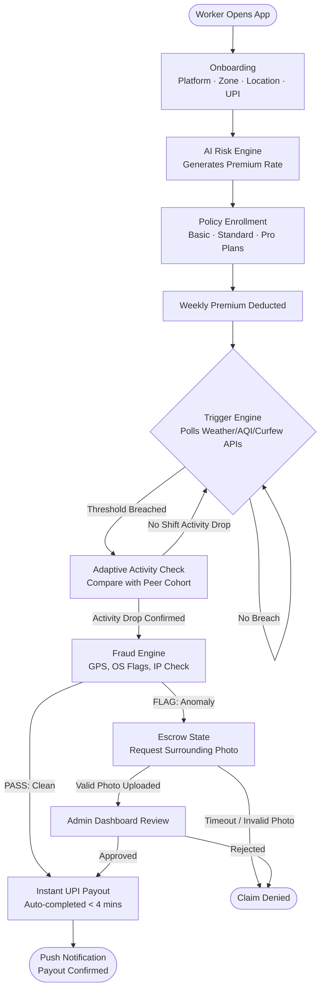
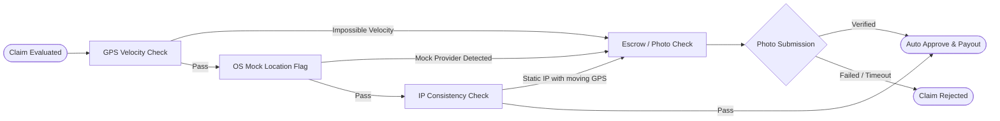

# GigInsura
### AI-Powered Parametric Income Insurance for India's Gig Economy · Phase 3 v3.2

> **No claim forms. No manual adjusters. No waiting.**
> GigInsura is an automated, trigger-based parametric income protection platform designed exclusively for food delivery partners (e.g., Zomato and Swiggy). By monitoring weather, zone-wide peer activity, and native device fraud signals in real-time, GigInsura auto-triggers and pays out claims via UPI in under 4 minutes when disruptions occur.

---

## 📑 Table of Contents

1. [Overview](#-overview)
2. [Problem Statement](#-problem-statement)
3. [Our Solution](#-our-solution)
4. [Worker Persona & Scenarios](#-worker-persona--scenarios)
5. [Application Workflow](#-application-workflow)
6. [Weekly Pricing & Dynamic Premiums](#-weekly-pricing--dynamic-premiums)
7. [Parametric Triggers](#-parametric-triggers)
8. [The GigInsura AI Engine](#-the-giginsura-ai-engine)
9. [Fraud Detection & Anti-Spoofing](#-fraud-detection--anti-spoofing)
10. [System Architecture](#-system-architecture)
11. [Database Models](#-database-models)
12. [API Reference](#-api-reference)
13. [Admin Dashboard](#-admin-dashboard)
14. [Local Setup](#-local-setup)
15. [Project Metadata & Team](#-project-metadata--team)

---

## 📌 Overview

**GigInsura** is built to shield India's food delivery workers from the financial impacts of hyper-local disruptions they cannot control. Extreme rainfall, toxic air quality, heatwaves, and local curfews directly slash order volume and disrupt earnings. 

Using localized environmental APIs and peer verification networks, GigInsura automates the underwriting, policy management, and claim-payment cycle. A weekly subscription covers income loss with no manual documentation, processing instant claims directly to the worker's UPI ID.

> [!IMPORTANT]
> **Coverage Scope:** GigInsura protects **income loss ONLY**. Accidental, health, life, and vehicle damage coverages are strictly excluded.

---

## 🎯 Problem Statement

India's gig workers represent a massive, vulnerable workforce carrying 100% of the financial risk of external disruptions.

| The Reality | The Gap |
| :--- | :--- |
| **5 Crore+ gig workers** across India | No tailored income protection product exists. |
| **20–30% monthly earnings** lost to climate & curfew disruptions | Traditional insurance is annual, expensive, and paperwork-heavy. |
| Disruptions are **measurable and verifiable** | Claims verification processes are manual, slow, and lack real-time automation. |
| Workers earn and budget on a **week-to-week cycle** | Policies demand upfront annual or monthly commitments. |

---

## 💡 Our Solution

GigInsura operates on three core pillars:

1. 🤖 **AI Risk Engine** – Computes dynamic weekly premiums using hyper-local risk profiles and seasonal patterns, keeping policies affordable.
2. ⚡ **Parametric Automation** – Checks weather, air quality, and curfew conditions. If thresholds are breached and peer activity drops, payouts are instantly triggered without manual claims.
3. 🔐 **Fraud Shield** – A multi-layer verification system combining GPS velocity checks, mock location detection, and network fingerprinting with a photo-based Escrow state to prevent location spoofing.

---

## 👤 Worker Persona & Scenarios

**Target Persona:** Full-time food delivery partners on Zomato / Swiggy in metropolitan Indian cities. Aged 20–35, earning ₹8,000–₹15,000 per week, budgeting week-to-week, and working long shifts entirely on mobile devices.

### 🌧️ Scenario 1 — Heavy Rainfall (Genuine Disruption)
* **Context:** Raju (27) delivers in South Delhi. Monsoon rains peak at 58mm/hr in his zone, order counts crash, and roads flood. He parks his bike for 4 hours.
* **Without GigInsura:** Raju loses ₹400 in daily earnings with no recourse.
* **With GigInsura (Standard Plan):** 
  1. The background trigger engine polls the weather API and detects rainfall > 15mm/hr.
  2. The system confirms Raju's location is in the affected zone and notes a drop in order activity.
  3. Zone peers confirm the disruption (no outliers). The fraud engine clears the claim.
  4. ₹400 is automatically paid out to Raju's UPI. 
  5. Raju receives a push notification: *"Heavy rain detected. ₹400 credited to UPI. Stay safe, Raju."*

### ☁️ Scenario 2 — Hazardous AQI (Air Quality Disruption)
* **Context:** Priya (24) delivers in Noida. Smog pushes the AQI to 435 (Severe). Outdoor advisories urge residents to stay inside.
* **With GigInsura (Pro Plan):**
  1. Air quality API registers AQI > 300.
  2. The system detects Priya is offline or order volume has crashed.
  3. A parametric claim triggers, resulting in a ₹700 payout to her UPI wallet, alongside a health alert.

### 🚓 Scenario 3 — Curfew / Zone Restriction
* **Context:** Arjun (31) delivers in Old Delhi. A sudden curfew/Section 144 order is declared at 6 PM. Arjun cannot access his primary delivery cluster.
* **With GigInsura (Standard Plan):**
  1. Civic alert APIs flag active curfew boundaries in Old Delhi.
  2. Raju's GPS confirms he is attempting to work near the boundary but is blocked.
  3. Payout triggers automatically, compensating for lost shift hours.

### 🛡️ Scenario 4 — Fraud Attempt (Location Spoofing)
* **Context:** A user attempts to use a GPS spoofing app to simulate presence inside a flooded zone in Delhi while remaining at home.
* **GigInsura's Shield:**
  1. **GPS Velocity Check:** The system detects a shift of 9km in 2 seconds -> anomaly flagged.
  2. **OS Mock Check:** The backend catches native Android/iOS flags indicating a mock location provider is active.
  3. **Network Check:** IP address remains static while GPS coordinates shift -> flagged.
  4. **Escrow State:** Instead of instant rejection, the claim is placed in Escrow. GigInsura sends a notification: *"Please upload a quick photo of your surroundings to verify your claim."*
  5. Without a valid, geo-tagged surroundings photo, the claim is rejected.

---

## 🔄 Application Workflow



---

## 💰 Weekly Pricing & Dynamic Premiums

GigInsura aligns its subscription cycles directly with the weekly payout schedules of Swiggy and Zomato partners.

### Core Insurance Plans

| Plan | Weekly Premium (Base) | Payout Cap | Target Audience |
| :--- | :---: | :---: | :--- |
| 🟢 **Basic** | ₹15 / week | ₹200 | Part-time riders, low-risk zones |
| 🟡 **Standard** | ₹30 / week | ₹400 | Full-time riders, moderate-risk zones |
| 🔴 **Pro** | ₹50 / week | ₹700 | High-income riders, high-risk zones |

### Dynamic Premium Formula
In the codebase, premiums are adjusted dynamically each week within a range of **₹29 (Floor) to ₹89 (Ceiling)**. The premium calculation uses the following neural model adjustments:
* **Base Premium:** ₹29
* **Zone Risk:** Adds up to +₹28 for critical zones (e.g., Velachery).
* **Claims Streak:** Deducts up to -₹18 for consistent claim-free weeks.
* **Weather Forecast:** Adds +₹10 if the next 7 days show high rain probability; deducts -₹5 if clear.
* **Seasonal Weight:** Adds +₹7 during peak monsoon months (e.g., October–November).

---

## ⚡ Parametric Triggers

Claims trigger automatically when environmental indices exceed defined bounds and coincide with worker activity drops:

| # | Disruption Event | Data Source | Threshold | Action |
| :---: | :--- | :--- | :--- | :--- |
| 1 | **Heavy Rainfall** | Open-Meteo API | ≥ 15 mm/hr | Instant Parametric Payout |
| 2 | **Severe Air Quality** | WAQI API | AQI > 300 | Instant Parametric Payout |
| 3 | **Curfew / Security** | Civic Alerts | Zone restricted | Instant Parametric Payout |
| 4 | **Extreme Heatwave** | Open-Meteo API | Temp > 45°C | Instant Parametric Payout |

---

## 🧠 The GigInsura AI Engine

The system utilizes **four custom-trained neural networks** powered by `brain.js` running on the Express backend, alongside a parametric calculator and an LLM chat assistant.

```
                  index.html (Worker App & Admin UI)
                                  │
                                  │ REST API
                                  ▼
                     server.js (Express Backend)
                                  │
      ┌───────────────────────────┼───────────────────────────┐
      ▼                           ▼                           ▼
    ml.js (AI Engine)       MongoDB Atlas (DB)       External APIs
    ├─ AI-1 Premium          ├─ Workers               ├─ Open-Meteo (Weather)
    ├─ AI-3 Fraud Check      ├─ Policies              ├─ WAQI (Air Quality)
    ├─ Churn Prediction      ├─ Claims                └─ Google Gemini (Chat)
    └─ Weather Forecast      └─ Fraud Flags
```

### 1. AI-1 — Premium Underwriting Model (`GigInsura-NN-v3.2`)
* **Purpose:** Sets the weekly premium.
* **Inputs (6 features):** Zone risk score, claims streak, active days count, baseline claim ratio (BCR) of the zone, 7-day forecast risk, and seasonal weight.
* **Output:** Normalised risk score mapped to the ₹29–₹89 price scale.

### 2. AI-2 — Parametric Payout Severity Calculator
* **Purpose:** Computes the exact payout amount dynamically.
* **Formula:**
  ```js
  intensity   = clamp((rainfall_mm_hr - 15) / 20, 0, 1);
  drop_ratio  = clamp(activity_drop_sigma / 3.0, 0, 1);
  multiplier  = 0.55 + (intensity * 0.25) + (drop_ratio * 0.20);
  payout      = round(shift_baseline_earnings * multiplier);
  payout      = clamp(payout, 100, 500); // Bounds: ₹100 to ₹500
  ```

### 3. AI-3 — Peer-Cohort Fraud Anomaly Classifier
* **Purpose:** Distinguishes genuine zone-wide disruptions from individual bad actors.
* **Peer Cohort Metrics:** Pulls real-time average activity drop, standard deviation, and claim rate of other active workers in the same zone and platform.
* **Neural Inputs:**
  * `peerDivScore` (35% weight) – Divergence of the claimant's activity drop compared to the peer cohort.
  * `newAcctScore` (20% weight) – Account age (high risk if < 7 days old).
  * `freqScore` (20% weight) – Number of claims filed in the last 7 days.
  * `rainGapScore` (15% weight) – Disruption claim made at negligible rainfall level.
  * `temporalScore` (10% weight) – Timestamps indicating suspicious clustering.
* **Output:** Anomaly Score (0.0 to 1.0):
  * `< 0.40` (Clean) → Claim auto-approved; payout proceeds.
  * `0.40 – 0.65` (Soft Flag) → Held for review, transitions to Escrow state.
  * `> 0.65` (Hard Flag) → Blocked, flagged for manual Admin review.

### 4. Churn Prediction Neural Net (`GigInsura-CHURN-v3.2`)
* **Purpose:** Forecasts worker churn probability.
* **Inputs:** Claims streak, total claims filed, premium-to-earnings ratio, days since last payout, zone risk, weeks enrolled.

### 5. Rainfall Forecast Neural Net (`GigInsura-FORECAST-v3.2`)
* **Purpose:** Predicts daily trigger probabilities for the next 7 days per zone to adjust premiums and display forecast warnings.
* **Inputs:** Month, day of week, forecast rainfall average, zone flood propensity, seasonal weight.

---

## 🛡️ Fraud Detection & Anti-Spoofing



1. **GPS Velocity Check:** Compares timestamps and distance. Physical speed anomalies (e.g. moving between zones faster than a motorbike could drive) flag the claim.
2. **OS Mock Location API:** Detects if developer options or mock location apps are mock-feeding coordinates to the application.
3. **Network Consistency:** Flags static residential IPs that simulate coordinates moving dynamically in the rain.
4. **Escrow Flow:** Workers flagged with minor anomalies are not outright blocked. They receive a push alert requesting a geo-tagged photo of their local environment to clear the escrow lock.

---

## ⚙️ System Architecture

* **Frontend (`index.html`):** A single-page dashboard utilizing responsive CSS. Features both the **Worker Portal** (mock GPS, policy registry, claim tracker, live weather feeds, interactive chat) and the **Admin Console** (KPIs, active fraud queues, neural net details, and live zone weather feeds).
* **Backend (`server.js`):** Node.js and Express REST API. Controls authentication, policy generation, dynamic pricing, and runs the background parametric trigger daemon.
* **AI/ML Engine (`ml.js`):** Integrates four `brain.js` neural networks directly into the Express event loop, allowing sub-millisecond local predictions without external infrastructure bottlenecks.
* **Database (`db.js`):** MongoDB Atlas instance mapping structured collections for workers, active weekly policies, historical claims, active fraud flags, and zone trigger logs.
* **APIs & LLM Chat:** Polls Open-Meteo for hyper-local rainfall/temperature and WAQI for air quality. Connects to the Google Gemini API (with a local rule-based intent fallback if keys are missing) for conversational policy assistance.

---

## 🗃️ Database Models

### Worker Schema
```json
{
  "_id": "ObjectId",
  "name": "String",
  "phone": "String",
  "platform": "String (Swiggy/Zomato/etc)",
  "workerId": "String",
  "zone": "String (e.g. Velachery)",
  "zoneId": "String",
  "upi": "String",
  "activeDays": "Number",
  "joinDate": "Date",
  "coverageStatus": "String (building_baseline | active)",
  "baselineEarnings": {
    "lunch": "Number",
    "dinner": "Number",
    "avg_orders_per_hr": "Number"
  },
  "streak": "Number",
  "riskTier": "String (low/med/high)",
  "policyStart": "Date"
}
```

### Policy Schema
```json
{
  "_id": "ObjectId",
  "workerId": "String",
  "weekStart": "Date",
  "weekEnd": "Date",
  "premium": "Number",
  "premiumBreakdown": {
    "base": "Number",
    "zoneAdj": "Number",
    "streakDiscount": "Number",
    "forecastSurcharge": "Number",
    "activityAdj": "Number"
  },
  "ml_info": {
    "model": "String",
    "confidence": "Number",
    "claim_probability": "Number"
  },
  "status": "String (active/expired)",
  "windows": [
    { "type": "String", "start": "Date", "end": "Date" }
  ]
}
```

### Claim Schema
```json
{
  "_id": "ObjectId",
  "workerId": "String",
  "date": "Date",
  "shift": "String (lunch/dinner)",
  "trigger": "String (Rainfall/AQI)",
  "amount": "Number",
  "status": "String (processing/paid/review)",
  "source": "String (automated_monitor/manual_check)",
  "payoutTime": "Number (minutes)",
  "upi": "String",
  "rainfall_mm_hr": "Number",
  "activity_drop_sigma": "Number",
  "severity_multiplier": "Number",
  "weather_source": "String (live/simulated)",
  "fraud_check": "Boolean",
  "ai1_approved": "Boolean",
  "ai2_payout": "Number",
  "ai2_severity": "Number",
  "ai3_approved": "Boolean",
  "ai3_flag": "String (clean/soft/hard)",
  "ai3_anomaly_score": "Number",
  "peer_context": {
    "peer_drop": "Number",
    "peer_low_activity_pct": "Number",
    "peer_claim_rate": "Number",
    "peer_sample_size": "Number",
    "peer_active_count": "Number",
    "source": "String"
  },
  "initiated_at": "Date",
  "completed_at": "Date"
}
```

### FraudFlag Schema
```json
{
  "_id": "ObjectId",
  "workerId": "String",
  "zone": "String",
  "shift": "String",
  "type": "String (soft/hard/clear)",
  "reason": "String",
  "anomalyScore": "Number",
  "signals": {
    "peerDivScore": "Number",
    "peerDrop": "Number",
    "peerMedianDrop": "Number",
    "peerDropStdDev": "Number",
    "peerLowActivityPct": "Number",
    "peerClaimRate": "Number",
    "peerAvgPayout": "Number",
    "peerSampleSize": "Number",
    "peerActiveCount": "Number",
    "newAcctScore": "Number",
    "freqScore": "Number",
    "rainGapScore": "Number",
    "temporalScore": "Number"
  },
  "status": "String (reviewing/flagged/cleared/rejected)",
  "generated_at": "Date",
  "resolved_at": "Date",
  "source": "String",
  "model_version": "String"
}
```

---

## 🔌 API Reference

### 1. Authentication
* `POST /api/auth/send-otp` – Requests a login OTP for a phone number.
* `POST /api/auth/verify-otp` – Verifies the OTP and returns a worker profile along with a JWT.
* `POST /api/auth/register` – Registers a new worker and automatically initializes their first weekly policy.

### 2. Worker Portal
* `GET /api/worker/:id` – Fetches a worker's profile details.
* `GET /api/worker/:id/policy` – Retrieves the active weekly policy.
* `GET /api/worker/:id/claims` – Fetches a worker's claims history and aggregated payout totals.
* `GET /api/worker/:id/safe-choice` – Generates a next-day proactive disruption advisory.

### 3. Claims & Triggers
* `POST /api/worker/:id/covered-check` – Live status endpoint comparing the worker's current metrics with their zone cohort.
* `POST /api/claims/trigger-check` – Manual override to run the trigger monitor sequence (for demo or testing).
* `GET /api/claims/:claimId` – Fetches details of a specific claim.

### 4. Environmental Feeds
* `GET /api/zone/:zoneKey/conditions` – Fetches live weather conditions and trigger states for a zone.
* `GET /api/zone/:zoneKey/forecast` – Generates a 7-day neural net trigger probability forecast.

### 5. AI Engines
* `POST /api/ai/calculate-premium` – Computes premium dynamics given raw risk parameters.
* `POST /api/ai/chat` – Interactive Gemini chat helper (falls back to intent rule-matching if API keys are absent).
* `GET /api/ai/model-info` – Lists the neural networks, feature indices, and live status.
* `GET /api/ai/churn-prediction/:workerId` – Evaluates active policy parameters to predict churn risk.

### 6. Admin Panel
* `GET /api/admin/stats` – Computes platform-wide analytics (GPW, average payout times, BCR).
* `GET /api/admin/zones` – Monitors rain levels, active worker counts, and adaptive thresholds across all 6 zones.
* `GET /api/admin/fraud-flags` – Fetches active fraud flags.
* `POST /api/admin/fraud-flags/:id/resolve` – Resolves a fraud flag (actions: `clear` or `reject`).

---

## 🖥️ Admin Dashboard

The built-in admin dashboard provides complete real-time monitoring of the GigInsura platform.

### Overview Panel
Displays platform KPIs:
* **Active Policies:** Total workers currently covered.
* **Weekly GPW (Gross Premium Written):** Aggregated premium cashflow.
* **Average Premium:** Blended premium average (historically around ₹63).
* **Current BCR (Benefit-Cost Ratio):** Claims payout ratio.
* **Avg Payout Time:** Auto-claim velocity (typically ~3.8 minutes).

### Zone Monitor
Monitors conditions across the 6 operating zones:

| Zone | Risk Level | Active Workers |
| :--- | :--- | :---: |
| **Velachery** | 🔴 Critical | 421 |
| **Adyar** | 🟠 High | 847 |
| **Guindy** | 🟡 Medium | 556 |
| **T. Nagar** | 🟢 Low | 1,203 |
| **Mylapore** | 🟢 Low | 634 |
| **Egmore** | 🟢 Low | 892 |

### UI Preview

#### Admin Dashboard Overview


#### AI Model Info Panel


#### AI Chat Assistant


---

## 💻 Local Setup

### Prerequisites
* **Node.js** (v18.x or higher)
* **MongoDB Atlas** database account
* *Optional:* Google Gemini API Key and WAQI API Token.

### Installation & Launch

1. **Clone the Repository:**
   ```bash
   git clone https://github.com/Samarth-3910/Gig_Insura.git
   cd Gig_Insura
   ```

2. **Install Dependencies:**
   ```bash
   npm install
   ```

3. **Configure Environment Variables:**
   Create a `.env` file in the root directory:
   ```env
   PORT=3001
   MONGODB_URI=your_mongodb_atlas_connection_string
   GEMINI_API_KEY=your_google_gemini_api_key
   WAQI_TOKEN=your_waqi_api_token
   ```

4. **Run in Development Mode:**
   ```bash
   npm run dev
   ```
   *On startup, the server connects to MongoDB, seeds initial database structures, runs the local training cycles for the 4 neural networks, and initializes the background trigger monitor.*

---

## 👨‍💻 Project Metadata & Team

* **Hackathon:** Guidewire DEVTrails 2026 — *Unicorn Chase*
* **Team Name:** RiskMatrix

### Team Members

| Name | Role |
| :--- | :--- |
| **Satvik Chaurasia** | Team Lead · Full Stack Developer |
| **Raghvendra Chauhan** | Backend · Fraud Detection ML |
| **Suryansh Chauhan** | Frontend · React Native · UX |
| **Samarth Kesari** | AI/ML · Risk Scoring · Dynamic Pricing |
| **Gargi Sharma** | Research · Strategy · Documentation |
